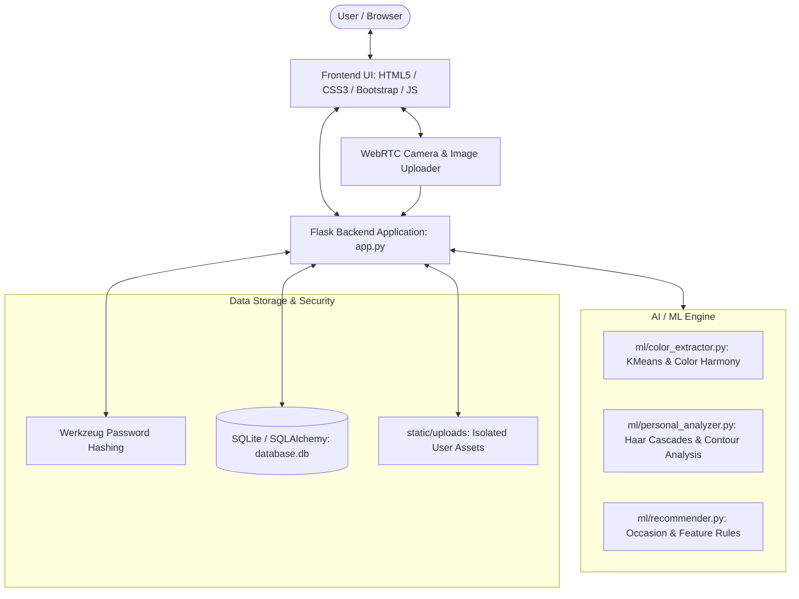

# StyleGuide AI – AI Wardrobe & Personalized Outfit Recommendation System
*Personalised Style Guidance Powered by Computer Vision & Fashion Intelligence*

---

## 🌟 Overview

**StyleGuide AI** is a production-style, intelligent fashion-technology web platform designed to streamline personal wardrobe curation and automate outfit recommendations. Built with a modern **Pink + Purple luxury aesthetic**, the application combines browser-based WebRTC camera capture, OpenCV computer vision algorithms, and tailored styling rules to deliver bespoke fashion advice.

Whether getting ready for an office presentation, a wedding celebration, college lectures, or a weekend date, StyleGuide AI analyzes your personal silhouette, skin tone, clothing harmony, and specific occasion to assemble cohesive, stylish ensembles.

---

## ✨ Core Features

1. **Digital Wardrobe Management**
   - Catalog **Clothes**, **Jewellery**, **Footwear**, and **Accessories**.
   - Subcategories including Tops, Shirts, Jeans, Trousers, Dresses, Kurtis, Sarees, Sneakers, Heels, Necklaces, Handbags, and more.
   - Dual input modalities: Upload from local storage or snap directly using real-time **WebRTC camera**.
   - Automatic dominant color extraction using **OpenCV and Scikit-Learn KMeans clustering**.

2. **Personal Features AI Analysis**
   - Real-time photo or webcam analysis of the user's appearance.
   - Facial detection and skin chrominance segmentation (YCrCb/HSV) to detect skin tone (**Fair, Light, Medium, Olive, Tan, Deep**) and undertones (**Warm, Cool, Neutral**).
   - Silhouette contour analysis for body shape estimation (**Hourglass, Pear, Rectangle, Inverted Triangle, Apple**).
   - AI heuristic physical proportion estimation (**Height** & **Weight**) clearly labeled as AI stylistic estimates.
   - Tailored garment recommendations and flattering color palettes based on detected features.

3. **My Style Recommendation Engine**
   - Select individual garments from your closet (Top, Bottom, or One-piece Dress/Kurti/Saree).
   - Select from 12 diverse occasions: *Casual, College, Office, Party, Wedding, Date, Festival, Interview, Travel, Traditional, Formal, Other*.
   - Generates AI footwear, jewellery, and accessory recommendations.
   - Computes a comprehensive **Style Compatibility Score** (e.g., 92%) with an explanatory "Why this works" fashion rationale.

4. **AI Outfit Generator**
   - One-click generative styling based on chosen occasion, season, aesthetic, and color preference.
   - Automatically orchestrates complete looks from head to toe using available wardrobe items.

5. **Favorites & Outfit History**
   - Save favorite wardrobe pieces and completed ensembles to your personal lookbook.
   - Archive past styling consultations with date stamps, style scores, and re-open capability.

6. **Secure Authentication & Strict Isolation**
   - Secure password hashing using PBKDF2/SHA-256 via Werkzeug.
   - Persistent user sessions via Flask-Login.
   - Absolute database isolation: User A can never see or modify User B's wardrobe.

7. **Modern Fashion-Tech Design System**
   - Pink and Purple gradient palette with glassmorphism touches.
   - Smooth animated left hamburger sidebar (collapsible desktop navigation + off-canvas mobile drawer).
   - Built-in Dark Mode / Light Mode toggle with local storage persistence.

---

## 🛠️ Technology Stack

- **Frontend**: HTML5, CSS3 (Custom Design System with CSS variables), JavaScript (ES6+), Bootstrap 5.3, FontAwesome 6.5.
- **Backend**: Python 3.11, Flask 3.1, Werkzeug.
- **Database**: SQLite with SQLAlchemy ORM (Flask-SQLAlchemy).
- **Computer Vision & AI/ML**:
  - `opencv-python`: Image processing, Haar Cascades face detection, contour analysis.
  - `scikit-learn`: KMeans clustering for dominant color extraction.
  - `Pillow (PIL)`: Image manipulation and file format conversions.
  - `numpy`: Matrix and vector manipulations for image data.
  - `pandas`: Data handling and classification structures.

---

## 🏛️ System Architecture



---

## 📂 Project Structure

```
StyleGuideAI/
│
├── app.py                      # Flask Application entry point & route controllers
├── config.py                   # Application configuration & upload constraints
├── requirements.txt            # Python dependencies
├── README.md                   # Complete documentation
├── .gitignore                  # Git ignore rules
├── sample_data.py              # 1-Click demo wardrobe data generator
│
├── database/
│   ├── __init__.py
│   └── db.py                   # SQLAlchemy instance initialization
│
├── models/
│   ├── __init__.py
│   ├── user.py                 # User model with authentication methods
│   ├── wardrobe.py             # WardrobeItem model
│   ├── personal_features.py    # PersonalFeatures CV analysis model
│   ├── outfit.py               # Complete Outfit ensemble model
│   ├── favorite.py             # Favorites model
│   └── recommendation.py       # Recommendation history model
│
├── ml/
│   ├── __init__.py
│   ├── color_extractor.py      # Dominant color extraction & harmony calculations
│   ├── personal_analyzer.py    # Skin tone, body shape, & proportion heuristics
│   └── recommender.py          # Rule & feature-based outfit and styling recommender
│
├── static/
│   ├── css/
│   │   └── style.css           # Pink-purple luxury fashion-tech styling
│   ├── js/
│   │   ├── main.js             # Sidebar, theme toggle, alerts
│   │   ├── camera.js           # WebRTC camera capture & snapshot module
│   │   └── wardrobe.js         # Dynamic categories, filters, & AJAX favorites
│   ├── images/
│   │   ├── logo.svg            # StyleGuide AI vector branding
│   │   ├── avatar-default.svg  # Default chic profile avatar
│   │   └── samples/            # 12 vector fashion garment templates
│   └── uploads/                # User uploaded media
│       ├── wardrobe/
│       ├── profiles/
│       └── analysis/
│
├── templates/
│   ├── base.html               # Shared layout & responsive sidebar
│   ├── login.html              # Login screen with password toggle
│   ├── register.html           # User registration screen
│   ├── dashboard.html          # Central dashboard & statistics
│   ├── wardrobe.html           # Digital closet manager & filter grid
│   ├── wardrobe_add.html       # Add piece via gallery or camera
│   ├── wardrobe_edit.html      # Edit piece details
│   ├── style.html              # My Style recommendation studio
│   ├── personal_features.html  # Computer vision analysis & estimates
│   ├── outfit_generator.html   # Head-to-toe AI outfit assembler
│   ├── favorites.html          # Saved items and outfits
│   ├── outfit_history.html     # Past recommendations archive
│   ├── profile.html            # Profile editor & avatar update
│   └── settings.html           # Appearance, demo loader, & danger zone
│
└── instance/
    └── database.db             # Auto-generated SQLite database
```

---

## 🚀 Installation & Local Setup

### 1. Prerequisites
- Python 3.11 installed on your system.
- Git installed.

### 2. Clone or Navigate to the Project Directory
```bash
cd StyleGuideAI
```

### 3. Create and Activate a Virtual Environment
**On Windows (PowerShell):**
```powershell
python -m venv venv
.\venv\Scripts\Activate.ps1
```

**On macOS / Linux:**
```bash
python3 -m venv venv
source venv/bin/activate
```

### 4. Install Dependencies
```bash
pip install -r requirements.txt
```

### 5. Launch the Application
```bash
python app.py
```

The server will initialize the SQLite database automatically on first launch and start listening at:
👉 **`http://127.0.0.1:5000`**

---

## 📸 Using the Camera Functionality

StyleGuide AI utilizes the HTML5 **`navigator.mediaDevices.getUserMedia`** API:
1. Navigate to **Add Item**, **Personal Features**, or **Profile Photo**.
2. Click the **"Open Camera"** or **"Use Camera"** tab.
3. Click **"Start Camera"**. When prompted by your browser, click **"Allow"** to grant camera access.
4. Preview the real-time video stream, align your item or portrait, and click the circular **Capture (Shutter)** button.
5. If satisfied with the snapshot, click **Save**; otherwise, click **"Retake Photo"** to reset the stream.
*Note: If camera permissions are denied or no camera device is connected, a clear notice is shown directing you to use the "Upload from Gallery" tab.*

---

## 🧠 AI / Computer Vision Details

- **Color Extraction**: Samples non-background garment pixels using OpenCV and executes KMeans clustering ($k=4$). Maps the extracted cluster center to the closest perceptual color name and generates matching hexadecimal codes.
- **Skin Tone Estimation**: Detects facial regions with OpenCV Haar Cascades, isolates cheek/forehead regions, converts pixels to the YCrCb chrominance space ($Cr \in [133, 175], Cb \in [77, 127]$), and calculates perceived luminance and RGB ratios to determine tone (*Fair, Light, Medium, Olive, Tan, Deep*) and undertones (*Warm, Cool, Neutral*).
- **Body Shape Detection**: Evaluates torso silhouette contours at shoulder ($\sim18\%$), waist ($\sim48\%$), and hip ($\sim75\%$) horizontal spans to classify hourglass, pear, inverted triangle, apple, or rectangle profiles.
- **Height & Weight Estimates**:
  > ⚠️ **Disclaimer**: Physical measurements derived from single photographic inputs are calculated using classical artistic anatomical proportions (head-to-body scale factors and silhouette aspect ratios). These values are clearly designated as **AI-based stylistic estimates** and not medical determinations.

---

## 🗄️ Database Architecture

The SQLite relational database maintains strict foreign-key integrity and user-level isolation:
- `users`: Credentials, profile information, password hashes, and timestamps.
- `wardrobe_items`: Individual items categorized into Clothes, Jewellery, Footwear, and Accessories with extracted hex colors.
- `personal_features`: User-specific AI estimations and styling notes.
- `outfits`: Complete ensembles connecting tops, bottoms, dresses, footwear, jewellery, and accessories.
- `favorites`: Lookbook favorites linking individual items and full outfits.
- `recommendation_history`: Records of every AI styling consultation.

---

## 🔮 Future Enhancements
- Integration of PyTorch / TensorFlow deep-learning clothing segmentation models (e.g. YOLOv8-pose or Mask R-CNN).
- Live weather API integration (OpenWeatherMap) for automatic rain/temperature wardrobe suggestions.
- Virtual Augmented Reality (AR) try-on overlay using WebGL.

---

## 📄 License
This project is developed for educational and professional portfolio demonstration purposes. All rights reserved.
